# PortfolioAnalyzer
Team Members: Pankaj Gautam, Michael Fiaani, Blandine Ishimwe, Omar Suleiman

PORTFOLIO ANALYZER:

The Portfolio Analyzer analyzes the perfomance of different Asset Portfolios over a time period. Below are the 3 parts to our projects:

1. Create a Portfolio of Stocks and analyze the perfomance of various Portfolios by Sectors,
2. Optimization of most favourable portfolio. 
3. Creating a dashboard with interactive visualization to view the perfomance of portfolios.

[Project Presentation](https://docs.google.com/presentation/d/1FC2qFnVyAURIEdi3Vhr_BPfVXIKGh5CAit9xvqNPEQ0/edit#slide=id.g13dd0be253b_0_159)

Summary of Project:

1. Overview

2. Data Sources

3. Python Library

4. Data Extract & Analysis

5. Results and Recommendations

1.Overview

The purpose of this project is to present a detailed analysis of stock perfomances with historical performance and predict the returns of the most favourable     portfolio.

Target clients: New Investors

2.Data Source

Yahoo Finance

ALPACA 

3.Python Library

Existing Libraries: Matplotlib, Pandas, Numpy, Hvplot, Plotly, Alpaca.

New Libraries: yfinance, pandas_datareader.

4.Data Extract & Analysis

Imported ticker data from yahoo finance for calculation of stock performances for year 2017 to 2021.

Identified the most favourable Portfolio based on returns, risk and Sharpe ratios.

Optimized the most favourable Portfolio using Monte Carlo Simulation and calculating the maximum Sharpe ratio.

Performed Monte Carlo Simulation to predict the return from a Portfolio over next 10 years.

Created interactive plots to view the returns generated from the portfolio and asses the risks associated with the Portfolio.

5.Results and Recommendations

Part1:

a. Cumulative Return

A cumulative return is the aggregate daily return that the stock has gained or lost over time. The cumulative return is expressed as a percentage based on the stock closing price.

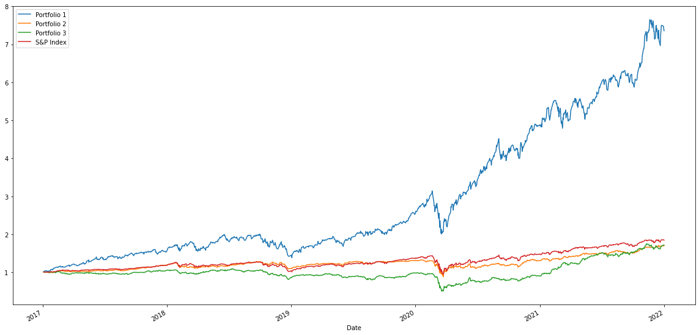

b. Sharpe Ratio

Sharpe ratio is a well-known and well-reputed measure of risk-adjusted return on an investment or portfolio. It can be used to evaluate the performance of an individual stock.

The Sharpe ratio indicates how well an equity investment performs in comparison to the rate of the S&P 500 index and NASDAQ.

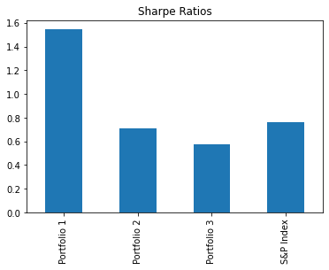

c. Rolling Standard Deviation

Standard deviation is the statistical measure of market volatility, measuring how widely prices are dispersed from the average price. If prices trade in a narrow trading range, the standard deviation will return a low value that indicates low volatility. A volatile stock has a high standard deviation, while the deviation of a stable blue-chip stock is usually rather low.

Rolling Standard Deviation is a metric calculated over the range of a shifting (rolling) window. The Annualized Standard Deviation is the standard deviation multiplied by the square root of the number of periods in one year (252 trading days).

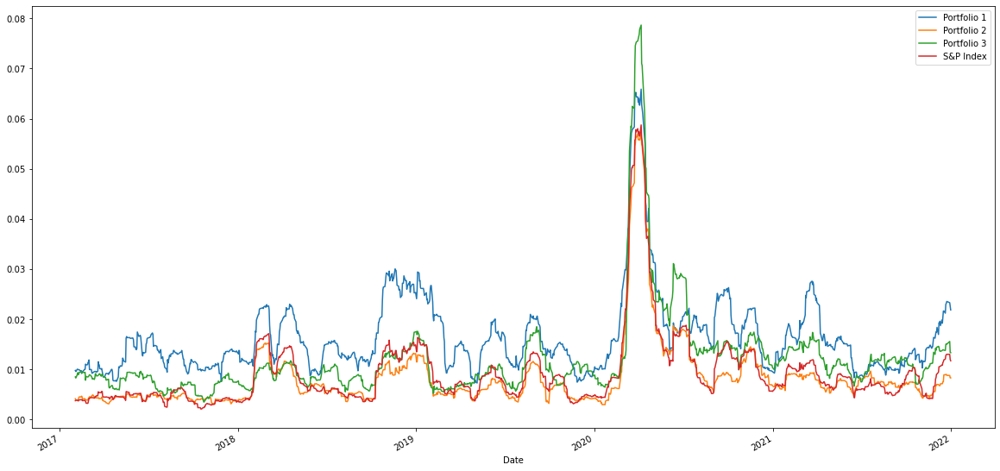

d. Correlation Matrix: A correlation matrix is a table showing correlation coefficients between variables.

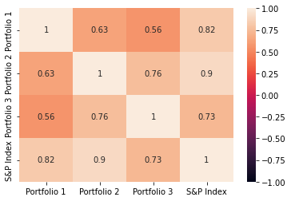

e. Portfolio Optimazation: Optimize a portfolio to assess maximum returns

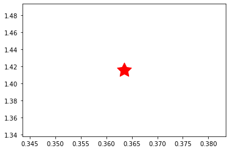

Recommendations:

1. The Standard deviation shows Portfolio 2 is least risky and less riskier than than the overall market (S&P Index)

2. Based on the beta plot, Portfolio 1 beta was much higher than the other 2 portfolios and the market.

3. The Sharpe ratios shows that Portfolio 1 has highest Sharpe ratio of 1.54 and it can genereate maximum return given the risk of Portfolio.

4. The MC Simulation anlysis shows that the optimal portolio with max sharpe ratio would give a return of 165% over 5 years.

Part 2:

a. Monte Carlo Simulation: 

Monte Carlo simulations are used to model the probability of different outcomes in a process that cannot easily be predicted due to the intervention of random variables. It is a technique used to understand the impact of risk and uncertainty in prediction and forecasting models.

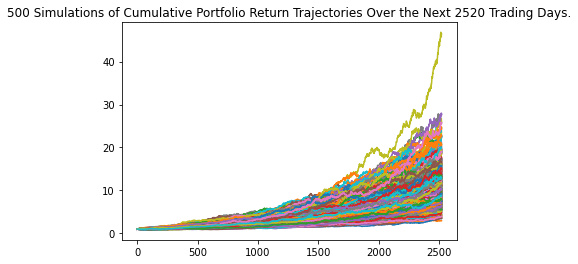

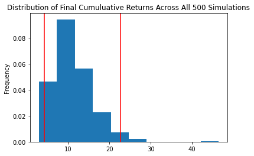

Recommendations:

b. Retirement anlaysis by investing in Portfolio 1:

The Monte Carlo Simulation shows that the Portfolio 1 can generate at least $216k and maximum $1.13 M over the next 10 years for clients.

c. Retirement anlaysis by investing 25% in Portfolio 1, 25% in SPY and 50% in Bonds:

The new Monte Carlo Simulation shows that the less riskirer portfolio can generate at least $100k and maximum $212k over the next 10 years for clients which seems a reasonable returns for a conservative investor.

Part 3: Creating a Portfolio dashboard for clients to view the returns from various portfolios over time 

a. Daily Returns of the Portfolios:

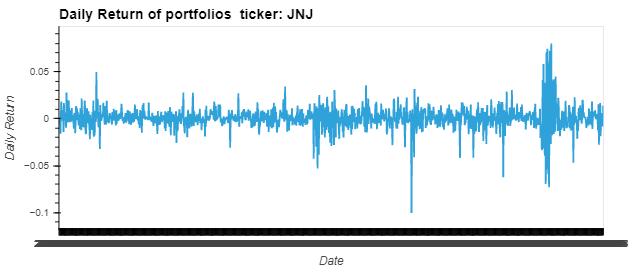

b. Daily Returns of the Portfolios by Sectorr:

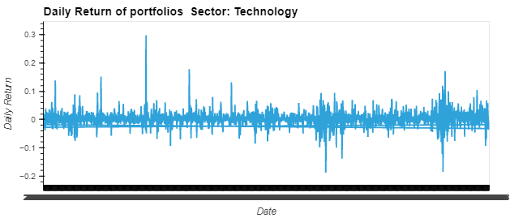

c. Cumulative Returns of the Portfolios:

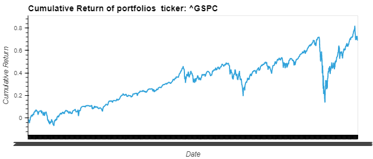

d. Risk vs Return by Portfolios and Sector:

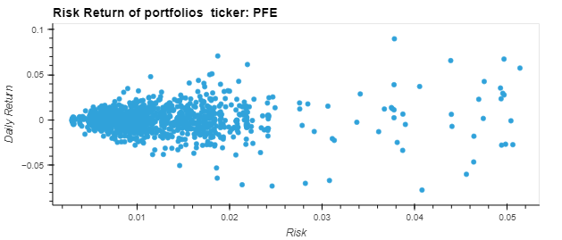
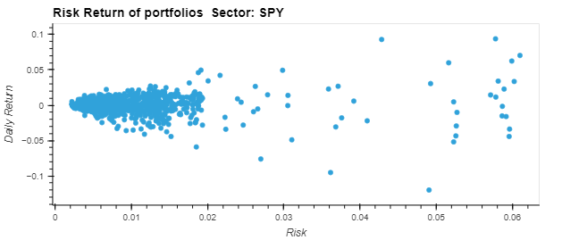

Recommendations:

The Hvplot shows that the tech sector returns were much larger than the other 2 sectors and overall market.

The 5 different hvplots would help a investor to determine the stocks to choose based on risk appetite and returns associated with them.

A younger investor would like to create a portfolio of stocks weighing more in technology, wherease a conservative investor might go with the SPY index funds or Combination of equity and Bonds.

